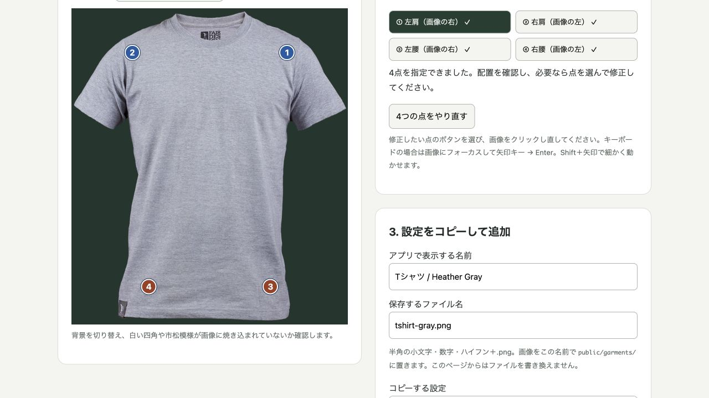

# 写真からTシャツ素材を作る手順書

**実物を撮る → 背景を透明にする → 4つの目印を付ける → アプリに入れる**、の順番で進めます。画像編集に慣れていない場合は、最初の1着に30〜60分ほど見ておくと安心です。

「透過PNG」とは、服の外側が透明な画像のことです。カメラ映像の上に置いても、四角い背景が出ません。服そのものの色・しわ・縫い目は写真のまま残します。

## まず、完成例を見てみる

1. プロジェクトのターミナルで `npm run dev` を実行します。
2. [素材の位置合わせツール](http://localhost:5173/tools/garment-setup.html) を開きます。ポート番号が違う場合は、ターミナルに表示されたURLの末尾に `/tools/garment-setup.html` を付けてください。
3. 今回使っているグレーのTシャツと、肩・腰の4つの点が表示されます。
4. 「背景の確認」を「濃い緑」にすると、服の外側が透明なことを確認できます。

このツールは、座標を計算して設定用の文章を作るためのものです。写真のアップロード・背景削除・プロジェクトへの自動保存は行いません。選んだ写真はブラウザ内だけで処理します。

公開版にこの変更を反映した後は、[公開版の位置合わせツール](https://fitt-ar.vercel.app/tools/garment-setup.html) も利用できます。

## 用意するもの

- 実物のTシャツ1着。最初は無地で、普通の半袖・丸首のものが簡単です。
- スマートフォン、服と色の違う無地の布または紙、明るい場所。
- パソコン、Chrome、[Photopea](https://www.photopea.com/)（ブラウザで使える画像編集ソフト）。
- 起動できる `fitt-ar` のプロジェクト。

ご自身またはチームが撮影した写真を使うと、出典を管理しやすくなります。ショップの商品画像を使う場合は、**画像の加工・Webでの公開・GitHubへの同梱**まで許可されているかを確認してください。「無料で閲覧できる」だけでは再配布の許可にはなりません。

## 1. Tシャツを撮影する

1. 大きなしわを伸ばし、平らな場所に**表側を上にして**置きます。小さな自然なしわは残して構いません。
2. 袖を軽く斜め下へ広げ、襟・両袖・裾が重ならないように整えます。
3. 服と背景の色を変えます。白いTシャツなら濃い無地の背景、黒いTシャツなら明るい背景が扱いやすいです。
4. 窓際などの柔らかい光を使います。強い直射日光、フラッシュ、身体やスマホの影は避けます。
5. スマホを服の中央の**真上**に持ち、カメラと服の面を平行にします。斜めから撮ると、片方の肩や裾だけが大きくなります。
6. 通常の写真モード・1倍で、服全体と少しの余白が入るように撮影します。ポートレートモードや超広角は使わないでください。
7. 撮った画像を拡大し、布目・縫い目がぼけていないか確認します。

**次へ進む目安：** 正面の服が1着だけ写り、左右の肩の高さがほぼ同じで、袖や裾が切れていないこと。人・手・ハンガーが写っている場合は、服だけの写真を撮り直すと切り抜きが簡単になります。

## 2. 写真をパソコンに移す

AirDrop、USB接続などで、なるべく**元の画質のまま**移します。画面のスクリーンショットを使うと解像度が下がります。編集前の写真は、手元に別名で保存しておきます。

ファイル名の例：編集前 `my-tshirt-original.jpg`、完成後 `my-tshirt.png`。

## 3. Photopeaで背景を透明にする

以下は英語メニュー名を併記しています。表示言語によって日本語表記が多少異なる場合は、英語名を目印にしてください。

1. [Photopea](https://www.photopea.com/) を開き、**File → Open（ファイル → 開く）** から写真を開きます。
2. 右のレイヤー欄で写真のレイヤーを選択します。鍵のマークがある場合はクリックして解除します。
3. 左のツールバーから **Magic Wand（自動選択／魔法の杖）** を選びます。見えない場合は選択ツールのアイコンを長押しして探します。
4. 上の **Contiguous（隣接）をON** にし、**Tolerance（許容値）を20前後** にします。服の外側の背景をクリックします。
5. 選択範囲の点線を確認します。服まで選ばれたら **Select → Deselect（選択解除）** で戻し、許容値を小さくして再選択します。背景が少ししか選ばれなければ、許容値を少し大きくします。
6. 背景だけが選ばれたら **Delete／Backspace** を押します。背景が灰色と白の市松模様になれば透明になっています。
7. **Select → Deselect** で選択を解除します。袖の隙間などに背景が残っていたら、そこを選択して削除します。
8. 200〜300%程度に拡大し、縁に残った背景や影を、小さな **Eraser（消しゴム）** で整えます。服の縫い目まで消さないようにします。間違えたら **Edit → Undo（元に戻す）** を使います。

背景と服の色が似ていて自動選択が難しい場合は、**Polygonal Lasso（多角形選択）** で服の輪郭を少しずつクリックして囲み、ダブルクリックで閉じます。**Select → Inverse（選択範囲を反転）** して背景を削除します。最初から色の違う背景で撮影すると、この作業を減らせます。

襟の穴に背景やハンガーが残っていないかも確認します。前側の襟のリブは残してください。服の内部の影は、立体感を作るので残します。

操作の参考：[Photopea公式・自動選択](https://www.photopea.com/learn/advanced-selecting)、[多角形選択](https://www.photopea.com/learn/creating-selections)、[レイヤー](https://www.photopea.com/learn/layers)。

## 4. 大きさを整えてPNGで保存する

1. **Crop（切り抜き）** ツールで大きすぎる余白を減らします。襟・袖・裾の外側に少し余白を残し、服を切らないでください。正方形にする必要はありません。
2. **Image → Image Size（画像サイズ）** で、縦横比を維持したまま長い辺を **1,000〜1,600px程度** にします。小さな写真を無理に拡大しても細部は増えません。
3. **File → Export As → PNG** で書き出します。完成ファイル名を `my-tshirt.png` にします。
4. 修正し直せるよう、必要なら **File → Save as PSD** で編集用ファイルも手元に保存します。アプリに置くのはPNGだけです。

**JPEGでは透明になりません。** 拡張子を `.jpg` から `.png` に書き換えるだけでも駄目です。PNGとして書き出してください。縦横比を変えて800×800などに引き伸ばすと、服が変形します。

参考：[Photopea公式・画像サイズ](https://www.photopea.com/learn/image-size)、[開く・保存する](https://www.photopea.com/learn/opening-saving)。

## 5. 透過状態と肩・腰の位置を確認する

1. [位置合わせツール](http://localhost:5173/tools/garment-setup.html) の「自分のTシャツ画像」で、完成したPNGを選びます。
2. 「透過あり」と表示されることを確認します。背景を「濃い緑」「白」に切り替え、四角い背景・白い縁・消し残しがないか見ます。透明な画素が1つでもある画像は「透過あり」と表示されるので、**見た目の確認も必要です**。
3. 次の順に4か所をクリックします。画面にも次にクリックする点が表示されます。

| 順番 | クリックする場所 | 間違えやすい点 |
| --- | --- | --- |
| ① 左肩 | **画像の右側**で、肩の関節が入る位置 | 袖の先端ではありません |
| ② 右肩 | **画像の左側**で、肩の関節が入る位置 | 左右は着用者を基準にします |
| ③ 左腰 | **画像の右側**で、着たときの股関節の高さ | 細いウエスト位置でも、裾そのものでもありません |
| ④ 右腰 | **画像の左側**の同じ高さ | ③とほぼ水平に置きます |

設定例：青い①②が肩、茶色の③④が腰です。画像の左右と着用者の左右が逆になる点に注意してください。

肩の縫い目が普通の位置にあるTシャツなら、その縫い目の上部付近から始めてください。肩の落ちた服やラグラン袖は、縫い目と関節の位置が異なります。腰は写真だけで正確に決められないため、着た状態を想像して仮置きし、次の手順で調整します。

間違えた点は、その点のボタンを選んでクリックし直せます。「4つの点をやり直す」で全部消せます。透明な余白を含めて計算しているため、**4点の指定後に画像を切り抜き直したら、点も指定し直してください**。

## 6. アプリへ追加する

1. ツールの「アプリで表示する名前」を、例として `自分のTシャツ / Navy` に変更します。
2. 「保存するファイル名」を `my-tshirt.png` にします。半角小文字・数字・ハイフンを使います。
3. Finder／エクスプローラーから、そのPNGをプロジェクトの **`public/garments/`** フォルダへコピーします。ツールに入力した名前と、大文字・小文字まで一致させてください。
4. ツールの「設定をコピー」を押します。
5. IntelliJなどで **`src/features/wardrobe/garments.ts`** を開きます。
6. 下のほうにある **`export const demoGarment: Garment = {` から、そのブロックを閉じる `}` まで**を選び、コピーした設定に置き換えて保存します。ファイル上部の `Point` と `Garment` の型定義は消さないでください。
7. `npm run dev` が動いていることを確認し、試着画面を再読み込みします。服のプレビューと名前が変わったら読み込み成功です。

ツールの設定は **現在の1着を差し替える**ものです。PNGをフォルダに置くだけでは切り替わりません。複数の服を選択する機能は、現時点では未実装です。

チームの撮影素材については、`public/garments/README.md` に「ファイル名・撮影者またはチーム名・撮影日・チームでの利用／公開許可」を追記します。個人の連絡先などを入れる必要はありません。

## 7. カメラで大きさ・位置を微調整する

1. 「カメラを起動」を押し、正面を向いて肩から腰まで映します。
2. 最初は「骨格を表示」をONにして、肩の点が服のどこに来るか見ます。
3. `garments.ts` の下表の値を**1つずつ小さく変更**し、保存 → 画面を再読み込みして比較します。
4. 調整できたら骨格表示をOFFに戻し、前後移動・左右移動・軽い身体の傾きを確認します。

| 見え方 | まず試す変更 | 意味 |
| --- | --- | --- |
| 肩や胴が狭い | `scaleX: 1` → `1.05` | 横幅を5%広げます |
| 横幅が広すぎる | `scaleX: 1` → `0.95` | 横幅を5%縮めます |
| 裾が短い | `scaleY: 1` → `1.05` | 肩中心を基準に丈を5%伸ばします |
| 裾が長すぎる | `scaleY: 1` → `0.95` | 丈を5%縮めます |
| 服全体が上すぎる | `offsetY: 0` → `0.02` | 肩〜股関節の長さの2%だけ下へ移動します |
| 服全体が下すぎる | `offsetY: 0` → `-0.02` | 少し上へ移動します |
| 左右にずれている | 鏡表示をOFFにして `offsetX` を±0.02ずつ調整 | プラスは通常表示の右。鏡表示では画面上の方向が逆です |

`rotationOffset` は通常 `0` のままで構いません。大幅な調整が必要なら、写真の傾きや4点の位置を見直します。画像そのものを左右反転する必要はありません。

今の実装では肩2点の幅と、肩中心から腰2点の中心までの長さを使います。腰の幅に合わせて裾の形を独立して変えることはできません。実際の服のサイズを測っているわけでもありません。

## 8. チームに渡す

素材を作る担当者がコードを編集しない場合は、次の3点を実装担当者へ渡せば追加できます。

- 完成した **PNGファイル**
- 位置合わせツールの **コピーした設定**
- **素材の出典と利用許可**（自分で撮影した場合は、その旨とチームでの公開許可）

実装担当者は `npm run lint` → `npm run typecheck` → `npm run test` → `npm run build` を実行します。画像・設定・出典を作業ブランチでコミットしてGitHubへpushし、PRを作成します。mainへマージし、Vercelのデプロイ完了後に公開URLでも確認してください。

## 困ったとき

| 症状 | 確認・直し方 |
| --- | --- |
| 服の周りが白い四角になる | JPEGや背景付きPNGではないか確認し、背景を削除してPNGで再出力 |
| 灰色の市松模様まで映る | 透明に見える模様が焼き込まれています。元画像から背景を切り抜き直す |
| 白い縁が目立つ | 切り抜き時の背景が残っています。濃い背景で確認しながら縁を修正 |
| 画像が読み込めない | ファイルの配置先・名前・大文字小文字を確認。URLには `public/` を含めない |
| 新しい画像に変わらない | 設定の `image` が新しい名前か確認し、ブラウザを再読み込み |
| 新しいPNGを選ぶと点が消えた | 正常です。別画像に古い座標を流用しないようリセットします |
| 点を指定したのに服が出ない | 肩・腰の左右が逆でないか確認し、カメラに両肩と腰を映す |
| 服が縦に伸びすぎる | 画像の腰の点が肩に近すぎないか確認。必要なら `scaleY` を少し下げる |
| 腕を上げても写真の袖が動かない | 現段階の制限です。服全体の拡縮・回転のみ対応しています |

デモでは明るい場所で正面を向き、腕を軽く下げると見せやすくなります。実写素材で布の質感は改善しますが、腕を服の前に重ねる処理・袖の変形・揺れの平滑化は別の実装が必要です。
